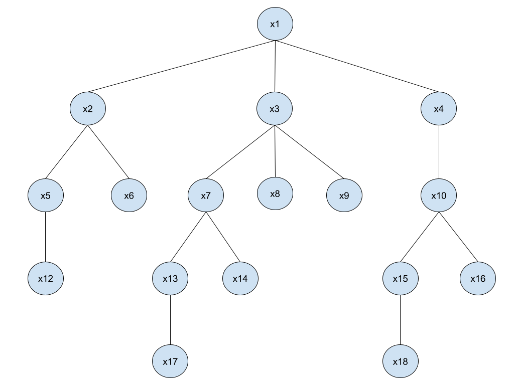

# Activity 3.1 - Regular languages

Reference for math symbols:
https://www.overleaf.com/learn/latex/List_of_Greek_letters_and_math_symbols

## Names:

- Sebastian Moncada (A01027028)
- Samuel Acevedo (A01026893)

## Exercises:

1.  Let $X$ be a finite set. Give a recursive definition of the set of subsets of $X$ (the Power set of $X$) $P(X)$. Use union as the operator on the definition

    _**SOLUTION:**_

    **I. Basis:**

    $$n \in X $$ 
    $$Y = \{1,2,3,4,...,n-1\} \ | \ Y\subset X$$

    **II. Recursive step:** if $X = Y \cup n$, then $P(X) = P(Y) \cup \{n\}$

    **For example:** Let $n = 3$. Then

    $$Y = \{1,2\}$$
    $$P(Y) = \{ \{ \},\{ 1 \},\{ 2 \},\{ 1, 2 \} \}$$
    $$\{ n \} = \{ 3 \}$$
    $$P(X) = P(Y) \cup \{ 3 \} = \{ \{ \},\{ 1 \},\{ 2 \},\{ 1, 2 \} \} \cup \{ \{ 3 \},\{ 1, 3 \},\{ 2, 3 \},\{ 1, 2, 3 \} \}$$

    **III. Closure:** $P(X) = P(Y) \cup \{n\}$ only if it can be obtained from the basis using a finite number of applications of the recursive step.

2.  Prove by induction on $n$ that:

    $\sum_{i=0}^{n}i^3 = \frac{n^2(n+1)^2}{4}$

    _**SOLUTION:**_

3.  Using the tree below, give the values of each of the items:
    

        a. the depth of the tree

        ``

        b. the ancestors of x18

        ``

        c. the internal nodes of the tree

        ``

        d. the length of the path from x3 to x14

        ``

        e. the vertex that is the parent of x16

        ``

        f. the vertices children of x7

        ``
