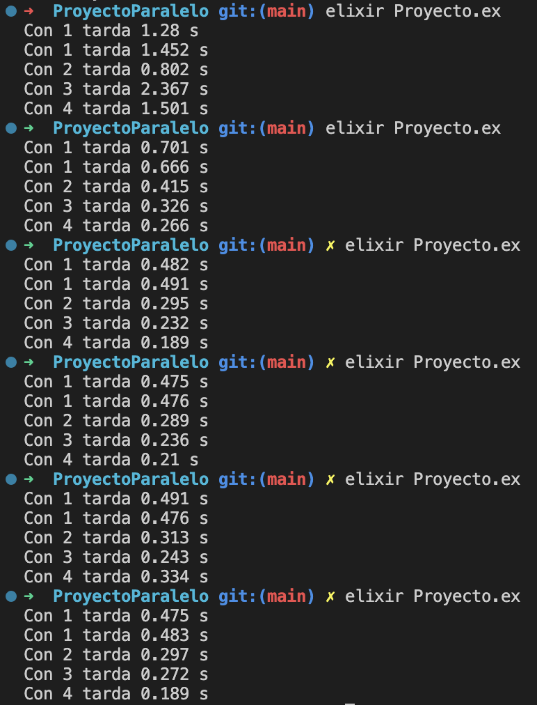

# <center>Resaltador de Sintaxis</center>


#### <center>Sebastian Enrique Moncada González - A01027028 </center>
#### <center>Samuel Roberto Acevedo Sandoval - A01026893 </center>

## <center>Materia: Implementación a métodos computacionales</center>

#### <center>Profesor: Gilberto Echeverria Furió</center>

## <center>16 de junio 2023</center>

## Cómo ejecutarlo y ejemplos de ejecución

```terminal
➜  ProyectoParalelo git:(main) ✗ elixir Proyecto.ex
```

Nosotros usamos 30 codigos de Python para forzar que se usaran todos los núcleos disponibles de los CPUs modernos.

Y unos de los Outputs que nos salieron fueron los siguientes:



Cómo podemos observar, todos los tiempos de la secuencia paralela son menores al de ña secuencial, los valores de 1 puede variar pues es igual con 1, pero los demás siempre son con un menor tiempo que el secuencial.

Ahora, usaremos la fórmula siguiente para calcular el tiempo de ejecución:

$$ S_p = \frac{T_1}{T_p} $$

Donde:

$p$ es el número de procesadores (o núcleos)

$T_1$ es el tiempo que tarda en ejecutarse la version secuencial del programa

$T_p$ es el tiempo que tarda en ejecutarse la versi ́on paralela del programa utilizando p procesadores.

$S_p$ es el $speedup$ obtenido usando $p$ procesadores

Nosotros utilizamos 4 procesadores para nuestra suma paralela, lo que nos dio el siguiente resultado:

$$ S_4 = \frac{0.475}{0.189} ≈  2.5132275132275134$$

Al calcular el speedup, utilizando la fórmula anterior, se obtiene un valor aproximado de 2.5132275132275134.

Lo anterior significa que al utilizar 4 procesadores en el enfoque paralelo, se logró obtener un speedup de aproxima de 2.5132275132275134 veces más rápido en comparación de la secuencial. Aquí podemos apreciar el beneficio de utilizar la programación paralela y así aprovechar todo el procesamiento de múltiples núcleos para acelerar la ejecución de tareas computacionalmente intensivas.

### Complejidad del algoritmo

Teniendo en cuenta que se uso practicamente el mismo código del resaltador de sintaxis podemos decir que la complejidad en cierto punto es de O(m*n), pero falta calcular las nuevas agregadas para este resaltador de sintaxis paralelo, por lo que lo haremos de forma breve:


#### highlightFiles:

```elixir
def highlightFiles(list, inDirPath, outDirPath) do
    list
    |> Enum.each(fn inFilePath ->
      outFilePath = Path.join(outDirPath, inFilePath 
        |> Path.relative_to(inDirPath) 
        |> String.split(".") 
        |> Enum.at(0) 
        |> Kernel.<>(".html"))
      highlightFile(inFilePath, outFilePath)
    end)
  end
```

En general esta función recibe una lista de archivos (list) y recorre cada uno de ellos usando Enum.each. Dentro del bucle, se realiza una serie de operaciones constantes como la construcción de la ruta de salida y la llamada a highlightFile, la cuál tiene una complejidad O(n*m), siendo esta la más grande, por lo que su complejidad se vuelve de misma forma O(n*m).

#### highlightSyntaxSequential:

```elixir
def highlightSyntaxSequential(inDirPath, outDirPath) do
    Path.wildcard(Path.join(inDirPath, "**/*.py"))
      |> highlightFiles(inDirPath, outDirPath)
end
```

La función highlightSyntaxSequential utiliza Path.wildcard para obtener una lista de archivos. Luego llama a highlightFiles (la cuál tiene una complejidad de O(m*n)) pasando la lista completa de archivos. La complejidad de Path.wildcard depende del número de archivos coincidentes en el directorio y subdirectorios. Si consideramos `k` como el número total de archivos coincidentes, la complejidad de highlightSyntaxSequential será O(k * m * n).

#### highlightSyntaxParallel:

```elixir
def highlightSyntaxParallel(inDirPath, outDirPath, cores) do
    list = Path.wildcard(Path.join(inDirPath, "**/*.py"))
    elements_amount = div(length(list), cores) + 1

    Enum.chunk_every(list, elements_amount)
      |> Enum.map(&Task.async(fn -> highlightFiles(&1, inDirPath, outDirPath) end)) # Create a new process
      |> Enum.map(&Task.await(&1))
end
```

La función highlightSyntaxParallel también utiliza Path.wildcard para obtener la lista de archivos. Luego, divide la lista en bloques de tamaño elements_amount y crea procesos paralelos utilizando Task.async y Task.await para llamar a highlightFiles (la cuál tiene una complejidad de O(m*n)) en cada bloque. El número de bloques será cores si cores es menor o igual al número total de archivos, de lo contrario, será igual al número total de archivos. En cada bloque, se realizan operaciones similares a highlightFiles. Si consideramos m como el número total de archivos coincidentes y k como el número de bloques, junto con la complejidad de la complejidad de highlightSyntaxParallel sería O(k * m) + O(m * n).

#### niceOutput:

```elixir
def niceOutput(time, cores) do
    seconds = time
      |> elem(0) 
      |> Kernel./(1_000_000) 
      |> Float.round(3) 
      |> Float.to_string() 
      |> Kernel.<>(" s")
    IO.puts("Con " <> Integer.to_string(cores) <> " tarda " <> seconds)  
end
```
La función niceOutput/2 realiza operaciones constantes como extracción de elementos de tupla, cálculos matemáticos y salida de datos. Su complejidad es constante, es decir, O(1).


Para ser los más precisos posibles diremos que la complejidad del algoritmo entero es de O(k * m) + O(m * n), pues consideramos que es la forma de tener una mejor claridad de la claridad del objetivo, además de que así comprobamos que el procesador realmente está dando todo de si para sacar esto de la mejor manera posible.

### Reflexión:

La programación paralela y los algoritmos eficientes tienen implicaciones éticas que deben ser consideradas. En primer lugar, la brecha digital puede ampliarse, ya que estas tecnologías requieren una infraestructura avanzada, lo que puede excluir a aquellos con recursos limitados. Además, la automatización resultante puede afectar el empleo y el mercado laboral, lo que plantea desafíos socioeconómicos y la necesidad de adaptación continua. También existe el riesgo de una dependencia excesiva de la tecnología, lo que puede socavar las habilidades humanas y la capacidad de tomar decisiones informadas. Además, las preocupaciones sobre privacidad y seguridad de datos son importantes, ya que el procesamiento eficiente implica la recopilación y el almacenamiento masivo de información personal. Es fundamental abordar estas preocupaciones éticas mediante la reducción de la brecha digital, la protección de empleos y habilidades, el fomento de la responsabilidad y la transparencia, y la protección de la privacidad y seguridad de los datos. De esta manera, podemos aprovechar el potencial de la programación paralela de manera ética y equitativa para el beneficio de toda la sociedad.