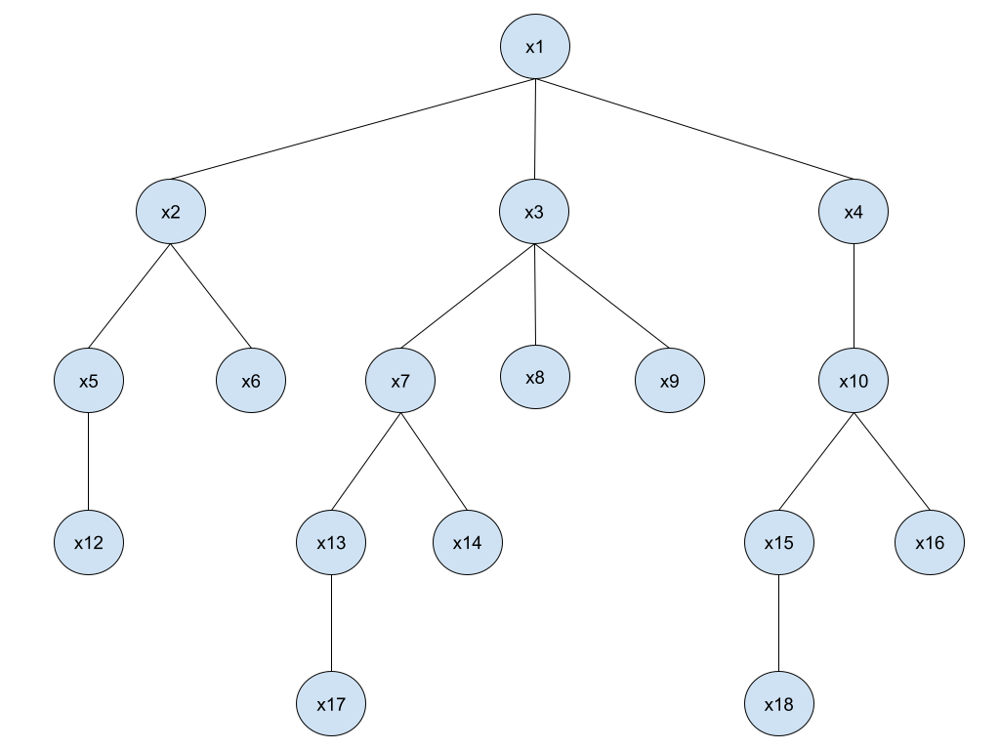

# Activity 3.1 - Regular languages

Reference for math symbols:
https://www.overleaf.com/learn/latex/List_of_Greek_letters_and_math_symbols

## Names:

- Sebastian Moncada (A01027028)
- Samuel Acevedo (A01026893)

## Exercises:

1.  Let $X$ be a finite set. Give a recursive definition of the set of subsets of $X$ (the Power set of $X$) $P(X)$. Use union as the operator on the definition

    _**SOLUTION:**_

    **I. Basis:**

    $$n \in X $$ 
    $$Y = \{1,2,3,4,...,n-1\} \ | \ Y\subset X$$

    **II. Recursive step:** if $X = Y \cup n$, then $P(X) = P(Y) \cup \{n\}$

    **For example:** Let $n = 3$. Then

    $$Y = \{1,2\}$$
    $$P(Y) = \{ \{ \},\{ 1 \},\{ 2 \},\{ 1, 2 \} \}$$
    $$\{ n \} = \{ 3 \}$$
    $$P(X) = P(Y) \cup \{ 3 \} = \{ \{ \},\{ 1 \},\{ 2 \},\{ 1, 2 \} \} \cup \{ \{ 3 \},\{ 1, 3 \},\{ 2, 3 \},\{ 1, 2, 3 \} \}$$

    **III. Closure:** $P(X) = P(Y) \cup \{n\}$ only if it can be obtained from the basis using a finite number of applications of the recursive step.

2.  Prove by induction on $n$ that:

    $\sum_{i=0}^{n}i^3 = \frac{n^2(n+1)^2}{4}$

_**SOLUTION:**_

I. **Basis:**:
If $n=0 \rightarrow$ $\frac{0^2(0+1)^2}{4} = 0$

II. **Inductive Hypothesis:**

$$\sum_{i=0}^{k}i^3 = \frac{k^2(k+1)^2}{4}$$

III. **Inductive Step:**

$$\sum_{i=0}^{k+1}i^3 = \frac{(k+1)^2((k+1)+1)^2}{4}\rightarrow$$
$$\sum_{i=0}^{k}i^3 + (k+1)^3 = \frac{(k+1)^2((k+1)+1)^2}{4}\rightarrow$$

With the hypothesis: $\sum_{i=0}^{k}i^3 = \frac{k^2(k+1)^2}{4}$ then

$$\rightarrow \frac{k^2(k+1)^2}{4} + (k+1)^3 = \frac{(k+1)^2((k+1)+1)^2}{4}$$
$$\rightarrow \frac{k^2(k+1)^2 + 4(k+1)^3}{4} = \frac{(k+1)^2((k+1)+1)^2}{4}$$

$$\rightarrow \frac{k^2(k+1)^2 + 4(k+1)^3}{4} = \frac{(k+1)^2((k+1)+1)^2}{4}$$

Now... $(k+1)^3$ can be seen as $(k+1)^2(k+1)$, therefore we can factorize:

$$\frac{(k+1)^2(k^2 + 4(k+1))}{4} = \frac{(k+1)^2((k+1)+1)^2}{4}$$
$$\rightarrow\frac{(k+1)^2(k^2 + 4k + 4)}{4} = \frac{(k+1)^2((k+1)+1)^2}{4}$$

$$\rightarrow\frac{(k+1)^2(k^2 + 4k + 4)}{4} = \frac{(k+1)^2((k+1)+1)^2}{4}$$

We know that $(a+b)^2 = a^2 + 2ab + b^2$, then $(k^2+4k+4)=(k+2)^2$ and $(k+2)^2$ also is $((k+1)+1)^2$, therefore: $(k+2)^2=((k+1)+1)^2$
Then:

$$\frac{(k+1)^2(k+2)^2}{4} = \frac{(k+1)^2((k+1)+1)^2}{4}$$
$$\rightarrow \frac{(k+1)^2((k+1)+1)^2}{4} = \frac{(k+1)^2((k+1)+1)^2}{4}$$

$$\square$$

3.  Using the tree below, give the values of each of the items:
    

        a. the depth of the tree

    The depth of the tree is 5.

        b. the ancestors of x18

        The ancestors are: x15, x10, x4 and x1.

        c. the internal nodes of the tree

        The internal nodes of the tree are x1, x2, x3, x4, x5, x7, x10, x13 and x15.

        d. the length of the path from x3 to x14

        The length of the path form x3 to x14 is 3.

        e. the vertex that is the parent of x16

        The vertex that is the parent of x16 is x10.

        f. the vertices children of x7

        The verticles children of x7 are x13 and x14.
